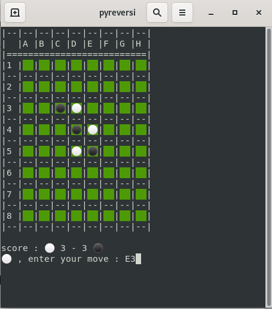

# :black_circle: :white_circle: pyreversi :black_circle: :white_circle: 

pyreversi is a reversi game in your terminal with IA available.

# Démo

# 🚀 How to use **pyreversi**

``pyreversi``

## IA options

- ``-b --blackbot [int]`` : black player is a bot, with level [int]
- ``-w --whitebot [int]`` : white player is a bot, with level [int]

- level 0 : one in available choices
- level 1 : max increase score
- level 2 : level 1 + not offer corner + target corner
- level 3 : level 2 + considering opponent turn to compute best score 
- level 4 : level 3 + considering safe place to compute best score
- level 5 : level 4 + prefer safe place 
## Other options

- ``-h/--help`` display help message
- ``-r/--rules`` display rules of reversi game
- ``-a/--auto`` auto mode (disable "press any key")
- ``-g/--games [n]`` batch mode with [n] games
- ``-n/--nocolor`` disable color (forced for windows)
- ``-u/--update`` self update the package
## Developper options

- ``-f/--fix`` : disable random choice in the set of best choices for IA
- ``-v/--verbose`` verbose mode
- ``-s/--silent`` silent mode

# ⚙️ Install

See [this page](INSTALL.md)

# :construction_worker: Contribution

See [this page](CONTRIBUTING.md)

# :package: Changelog

See [this page](CHANGELOG.md)

# License

MIT License

Copyright (c) 2021 [thib1984](https://github.com/thib1984)

See [this page](LICENSE.txt) for details
